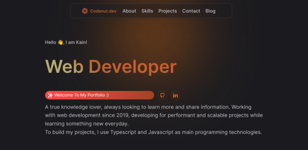

<h1 >🌟 My Official Portfolio ✨</h1>

> **Hi, welcome to my portfolio repository!**

<div align='center'>

</div>

<br/>

This is my portfolio website repository were I describe myself, show my projects and talk about my work. It is available in both portuguese and english, translated with the i18next standards.

I have also integrated my blog into this project in the version 4.0.0, so it can be much confortable for me to keep everything up to date, you can check it [here](https://codenut-dev.vercel.app/blog).

Feel free to visit my portfolio using the link below:

> **Go Live! at: [https://codenut-dev.vercel.app](https://codenut-dev.vercel.app)**

## 🐾 Project Stack

- [Next.js](https://nextjs.org/) - A React framework with hybrid static & server rendering, and route pre-fetching, etc.
- [Styled Componets](https://styled-components.com/) - A robust component css-in-js styling library for React and React native.
- [Framer Motion](https://www.framer.com/motion/) - An animation library for React.
- React Markdown - for rendering blog pages.
- Feed - for generating rss feeds.

## 🌳 Project structure

```
$PROJECT_ROOT
│
├── public
└── src
    ├── components
    ├── context
    ├── data
    ├── lib
    │   # translation modules and JSON files
    ├── locales
    ├── pages
    ├── shared
    ├── styles
    └── types
```

## ☘️ Find me!

E-mail: [nhantumbok@gmail.com](nhantumbok@gmail.com 'Send an e-mail')\
Github: [https://github.com/KainNhantumbo](https://github.com/KainNhantumbo 'See my github profile')  
My blog: [https://codenut-dev.vercel.app/blog](https://codenut-dev.vercel.app/blog 'Visit my website')

#### If you like this project, let me know by leaving a star on this repository.

Best regards, Kain Nhantumbo.\
✌️🇲🇿 **Made with ❤ React + Vite and Typescript**

## 📜 License

Licensed under Apache 2.0 License. All rights reserved.\
Copyright &copy; 2023 Kain Nhantumbo.
